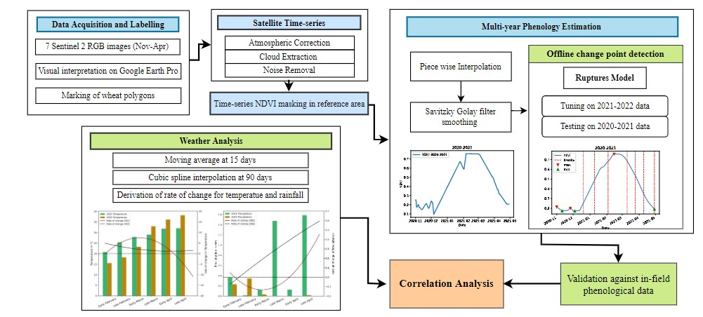

# wheat-phenology-estimation
# Introduction
This repository contains code for monitoring wheat growth &amp; climate impact using satellite NDVI in South Asia, using machine learning techniques for data analysis and visualization. 

1. [Methodology](#methodology)
2. [Results](#results)
3. [Visualizations](#visualizations)
4. [Conclusion](#conclusion)

## Methodology

Our work uses satellite time-series data acquisition, preprocessing and NDVI masking for time-series analysis. The calculated NDVI
is followed through cubic spline and SG filter. Offline change point detection is applied using Ruptures model with parameter
tuning on 2021-2022 and testing on 2020-2021. The obtained multi-year phenological results are validated against in-field
phenological dates. The results are correlated with rate of change in weather data, smoothed at 15 and 90 day interval using
moving average and cubic spline for in-depth correlation analysis between weather and phenology.

## Results 

The results can be summarized in the form of a table showing the predicted dates of the 5 key phenological stages namely:

> * Stem Elongation
> * Heading 
> * Medium Milk
> * Hard Dough 
> * Harvest

Following image shows how we used the rate of change of temperature and rainfall with respect to the number of days during the key growth stages of
wheat to study its effect on the life stages of wheat described above. This helps in understanding the stunted yield during the year 2021. Due to the 
high rate of change of wheather variables during the 2021, the maturation of wheat got adversely affected. 

## Visualizations

Here we show how we visualize the change in NDVI over the 2000 acre land under observation. We mark the boundary with the help of Google Earth, highlighting areas containing wheat with the help of polygons created using Google Earth. Furthermore, we use the Sentinel-2 Satellite to extract the NDVI for this region. Following figure visualizes the different values of NDVI over the course of the life stage of wheat.

## Conclusion

The results of this study highlight the capability of the proposed method to accurately and efficiently detect the
significant phenological stages in near-real time. The approach is transferable to multiple years with varying weather conditions
and number of satellite observations for a heterogeneous, small-scale crop distribution site with no ground data. Moreover, the
proposed novel method of ground truth labelling can aid in automated crop type mapping for regions with no ground data
availability. 

